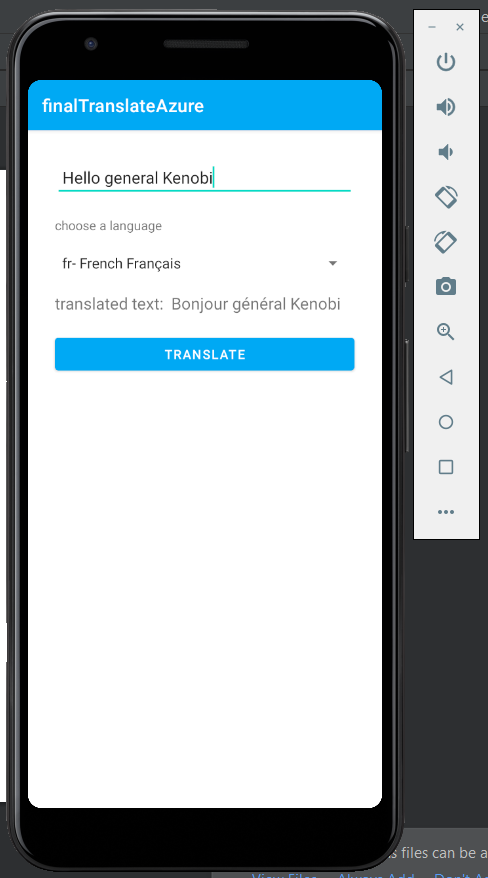
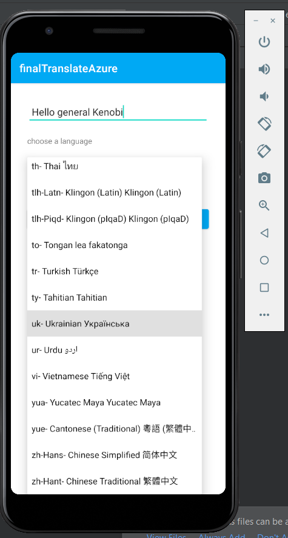

# Приложение для перевода текста (Azure) на зачёт

В завершение нашего семестра мы разработаем комплексное приложение для перевода текста.
За основу можно взять проект  https://github.com/ipetrushin/AzureTranslation , в тексте добавлены в качестве подсказки TODO-комментарии.

Количество баллов за Ваше решение зависит от реализованной функциональности

Основные (рекомендуемые) этапы создания приложения (всего 15 баллов):

- [x] разработать интерфейс для реализуемых функций: поля для ввода и вывода текста, список для выбора языка
- [x] реализовать отображение списка языков на Spinner
- [ ] список языков хранить на устройстве (хранится в массиве; не созраняется на 24 и каждый рз генерится занового)
- [x] реализовать перевод текста
- [x] при возникновении ошибок о них нужно сообщать пользователю и в системный журнал (сохраняется в Logcat)

[Видео с демнострацией работы приложения ](v1.mp4)

Задания на дополнительный балл:

- [ ] хранение истории переводов (текст и дата) с возможностью выбора ранее переведённого текста (7 баллов)
- [ ] озвучивание исходного и переведённого текста (используйте шпаргалку  https://git.io/JkIU0) (12 баллов)
- [ ] использование собственных ключей сервиса Azure (приложите подтверждающие снимки экрана) (2 балла)

В качестве ответа приложите: ссылку на проект или файлы с исходным кодом; снимки экрана или видео с демонстрацией работы; текстовое описание реализованных функций (что удалось сделать и что не работает).
